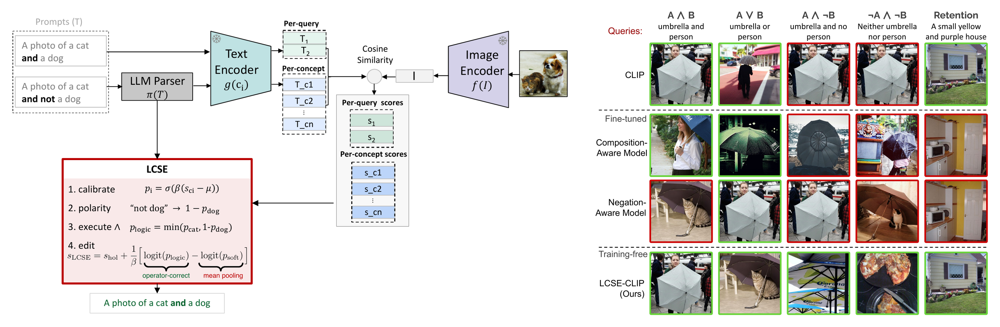

<div align="center">

# Similarity Is Not Logic

**Factored Inference for Dual-Encoder Vision-Language Models · ICML 2026**

🌐 [Project Page](https://sultanmo.github.io/factored-vlm/) · 📄 [Paper](https://sultanmo.github.io/factored-vlm/static/pdfs/paper.pdf) · 🧩 [LCSE](#lcse-logic-constrained-score-editing) · 🗃️ [FACTOR-Bench](#factor-bench) · 🤗 [Dataset](https://huggingface.co/datasets/sulmo/FACTOR-Bench) · 📊 [Reference Results](#reference-results)

[](https://icml.cc/virtual/2026/poster/65419)
[](LICENSE)
[](https://huggingface.co/datasets/sulmo/FACTOR-Bench)



</div>

CLIP-style similarity scores ignore the logical structure of a query, even
though the text embedding encodes it, and fine-tuning does not fix this.
**LCSE** (Logic-Constrained Score Editing) executes the logic outside the
frozen model: no retraining, 58.3% to 85.5% on Boolean queries with CLIP, and
standard retrieval is preserved.

This repository contains the LCSE reference implementation and
**FACTOR-Bench**, the benchmark the paper introduces for Boolean operator
semantics.

## News

- **2026-07**: Initial release: LCSE reference scorers and FACTOR-Bench v1.0.

## LCSE: Logic-Constrained Score Editing

Given a parsed query (concepts, polarities, operator), LCSE scores each
concept with the frozen encoder, calibrates the scores to probabilities,
applies polarity and a power-mean aggregation (soft min for AND, soft max for
OR), and edits the holistic similarity by the logit-space difference between
the logical aggregate and the plain mean. When a query has no operators the
correction is exactly zero, which is why retrieval is unaffected.

`lcse_scorer` in [`eval.py`](eval.py) implements this over any `open_clip`
model:

```python
from eval import lcse_scorer

score = lcse_scorer("ViT-B-32", "openai")   # SigLIP 2: "hf-hub:timm/ViT-B-32-SigLIP2-256", mu=0.05
sample = {
    "caption_a": "a cat and no dog",
    "parse_a": {"operator": "AND",
                "concepts": [{"text": "cat", "is_negated": False},
                             {"text": "dog", "is_negated": True}]},
}
print(score("photo.jpg", sample, "a"))      # LCSE-edited similarity
```

## FACTOR-Bench

Each sample is a two-alternative forced choice: one image and two captions
that share the same concepts but differ in logical structure. A
bag-of-concepts scorer sees two identical concept sets and lands at chance.
1,695 samples built from COCO val2017, all OWL-ViT-validated, with oracle
parses embedded.

- **operator** (1,100): NOT / AND / OR / BUT_NOT / NEITHER. The main accuracy metric, chance = 50%.
- **equivalence** (450): De Morgan / double negation / commutativity. Metric = score-consistency violation rate.
- **compound** (145): 3-4 concepts, mixed polarity.

<details>
<summary><b>What a sample looks like</b></summary>

```json
{
  "sample_id": "not_explicit_0000",
  "test_type": "operator",
  "operator": "NOT",
  "image_id": 233825,
  "image": "val2017/000000233825.jpg",
  "caption_a": "an orange",
  "caption_b": "there is no orange",
  "correct": "b",
  "parse_a": {"concepts": [{"text": "orange", "is_negated": false}], "operator": "SINGLE"},
  "parse_b": {"concepts": [{"text": "orange", "is_negated": true}],  "operator": "SINGLE"},
  "meta": {"difficulty": "easy", "position_swapped": true, "...": "..."}
}
```
</details>

## Quickstart

**1. Get the images** (COCO val2017, ~1 GB, not redistributed here):
```bash
wget http://images.cocodataset.org/zips/val2017.zip && unzip val2017.zip -d coco
```

**2. Evaluate any `open_clip` model:**
```bash
pip install -r requirements.txt
python eval.py --image-root ./coco --model ViT-B-32 --pretrained openai --split operator
```
The full operator split takes a few minutes on one GPU. For a 60-second smoke
test of your setup, add `--limit 50`.

**3. Or plug in your own scorer:** any `score_fn(image_path, caption) -> float`
(higher = better match):
```python
from eval import load, evaluate
samples = load("data/factor_bench.jsonl")

def my_score(image_path, caption):
    ...                      # your model here
    return float(...)

print(evaluate(my_score, samples, image_root="/path/to/coco", split="operator"))
# -> {'NOT': .., 'AND': .., 'OR': .., 'BUT_NOT': .., 'NEITHER': .., 'Overall': ..}
```

**Load from the [HuggingFace Hub](https://huggingface.co/datasets/sulmo/FACTOR-Bench):**
```python
from datasets import load_dataset
ds = load_dataset("sulmo/FACTOR-Bench", split="test")
```

## Reference results

Operator-split accuracy (%) as reported in the paper:

| | CLIP holistic | CLIP LCSE | SigLIP 2 holistic | SigLIP 2 LCSE |
|---|---|---|---|---|
| NOT     | 58.0 | 88.0 | 59.7 | 92.7 |
| AND     | 68.7 | 84.7 | 76.7 | 89.3 |
| OR      | 42.0 | 90.7 | 74.0 | 98.7 |
| BUT_NOT | 66.0 | 82.8 | 68.8 | 86.4 |
| NEITHER | 54.4 | 82.4 | 55.2 | 88.8 |
| **Overall** | **58.3** | **85.5** | **65.0** | **90.7** |

```bash
# CLIP ViT-B/32  (needs: pip install git+https://github.com/openai/CLIP.git)
python eval.py --image-root /path/to/coco --scorer paper_lcse --split operator

# SigLIP 2
python eval.py --image-root /path/to/coco --scorer lcse \
    --model hf-hub:timm/ViT-B-32-SigLIP2-256 --mu 0.05 --split operator
```

`eval.py` reproduces the CLIP columns exactly and SigLIP 2 to within one
sample per operator (Overall matches for all columns).

## Documentation

- [`docs/DATACARD.md`](docs/DATACARD.md): composition, collection and
  validation, anti-shortcut design, intended use, license.
- [`docs/SCHEMA.md`](docs/SCHEMA.md): field-by-field schema.
- Integrity: `python validate.py`, or check
  `sha256(data/factor_bench.jsonl) = 37f179a66913d2fbf55bf4f9a852273e894d53683dda0c7a8a7fff6c7b7d387d`.

## Citation

```bibtex
@inproceedings{alshehri2026similarity,
  title     = {Similarity Is Not Logic: Factored Inference for Dual-Encoder Vision-Language Models},
  author    = {Alshehri, Sultan and Yang, Zhantao and Zhang, Han and Savvides, Marios},
  booktitle = {International Conference on Machine Learning (ICML)},
  year      = {2026}
}
```

## Contact

Questions and issues are welcome on the
[issue tracker](https://github.com/SultanMo/factored-vlm/issues), or by email:
salshehr@andrew.cmu.edu.
